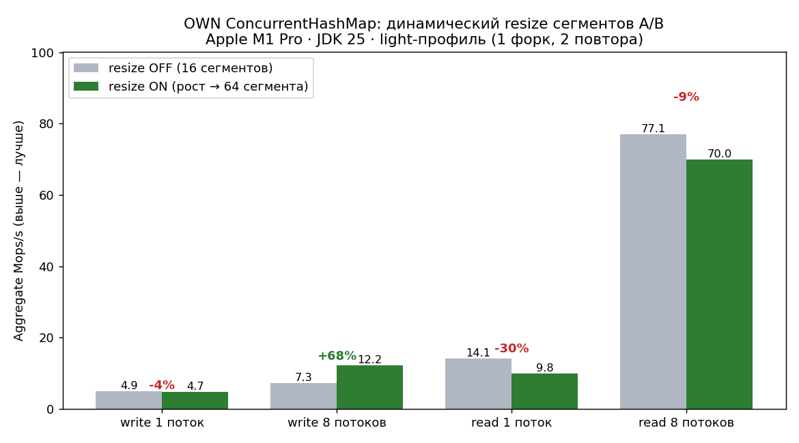

# Лаба 4 — бенчмарки ConcurrentHashMap

Потокобезопасная хеш-таблица с закрытой адресацией
([`hashmap.ConcurrentHashMap`](src/main/kotlin/hashmap/ConcurrentHashMap.kt):
striped-сегменты с `ReentrantLock` (старт 16, **число растёт динамически
под нагрузкой**), separate chaining, lock-free чтения через
`AtomicReferenceArray` + `@Volatile`) против JDK `ConcurrentHashMap`,
`Collections.synchronizedMap` (SYNC) и `java.util.HashMap` (baseline
`PlainHashMap`, в JSON — `UNSAFE`).

## Документы

| Документ | Назначение |
| --- | --- |
| [`docs/REPORT.md`](docs/REPORT.md) | Краткий отчёт: ключевые таблицы и выводы |
| [`docs/DRAFT.md`](docs/DRAFT.md) | Подробный отчёт: все таблицы, графики, разбор аномалий |
| [`docs/METHODOLOGY.md`](docs/METHODOLOGY.md) | Реализации, метрики, методология замеров, чтение графиков |

Графики — [`docs/img/full/`](docs/img/full/). Данные —
[`results/full/jmh-results.json`](results/full/jmh-results.json) (118 строк,
полное покрытие без пропусков). Регенерация — `python3 scripts/plot_results.py`.

> ⚠️ Полный прогон (`results/full`, графики, таблицы в `docs/`) снят на
> реализации с **фиксированными 16 сегментами**. Динамический fair-resize
> числа сегментов добавлен позже и провалидирован на light-прогоне
> ([`docs/DRAFT.md` §15](docs/DRAFT.md)); полный ре-ран на новой
> реализации ожидается.

## Стенд

| Поле | Значение |
| --- | --- |
| CPU | AMD Ryzen 7 7800X3D (8 ядер / 16 потоков, 96 МБ L3) |
| JDK / JMH | OpenJDK 26.0.1 / JMH 1.37 |
| Heap | `-Xmx24g -Xms256m`, G1GC |
| Forks | 2; main 5×10 с прогрев + 5×10 с измерение (Scaling 5×1 с + 5×2 с; Latency sample 5×500 мс + 5×1 с) |

## Главные выводы

- **Чтения OWN скейлятся почти линейно до 8 потоков** (×7.9), затем плато
  под SMT; идут вровень с JDK (723 против 839 M ops/s на 8 потоках).
- **Записи OWN** в pre-resize прогоне упирались в 16 сегментных локов
  (плато ≈ 36 M ops/s, ×2.3); JDK CAS-ит на уровне bin → ×7.4 (111 M).
  Этот потолок **снят динамическим resize**: light-A/B даёт **+67 %** к
  write @ 8 t (7.3 → 12.2 Mops/s, 16 → 64 сегмента) — см. ниже.
- **SYNC коллапсирует** уже после 1 потока (один глобальный лок).
- **Латентность** медианно ≈ 50 нс у всех трёх concurrent-реализаций;
  разница в хвосте — GC/safepoint-паузы, не структура данных.
- **Корректность** OWN (включая concurrent resize) подтверждена `jcstress`
  (4 теста) и JUnit.

## Динамический resize сегментов (light-валидация)

OWN растит число сегментов под нагрузкой (16 → 64 на 1 M записей; дефолтный
watermark 16 384, потолок 1024). A/B на Apple M1 Pro / JDK 25 (light-профиль,
2 повтора; **другой стенд, чем full**):

| метрика (OWN) | resize OFF (16 сег.) | resize ON (рост → 64) | Δ |
| --- | ---: | ---: | ---: |
| `write_thr08` | 7.3 Mops/s | **12.2 Mops/s** | **+67 %** |
| write 1→8 scaling | 1.47× | ≈2.6× | ≈ ×1.7 |
| `read_thr01` | 14.1 | 9.8 | −30 % (trade-off) |
| `read_thr08` | 77.1 | 70.0 | ≈0 (шум) |



Разбор и оговорки — [`docs/DRAFT.md` §15](docs/DRAFT.md).

## Аномалии (кратко)

| Severity | Аномалия | Доказательство |
| --- | --- | --- |
| TIER-1 | OWN write плато + −18 % на 16 t (**адресовано** resize) | `36.2 → 29.8 M`; 16 сегментных локов |
| TIER-1 | OWN mixed регрессия 15–19 % на 16 t | `rs0.2 −19 %, rs0.5 −15 %, rs0.8 −17 %` |
| TIER-2 | `readOwnSingle_thr01` < `read_thr01` OWN | `68.3 < 91.7 M` — dual-фикстура `*Unsafe` |
| TIER-3 | `read_thr01/02` JDK широкий CI | `relErr 22.6 % / 31.8 %` — `fork ≥ 5` |

Полный разбор tiers — [`docs/DRAFT.md` §10](docs/DRAFT.md).

## Воспроизведение

```bash
./gradlew test --no-daemon -q                   # JUnit (вкл. concurrent resize)
./gradlew jcstress --no-daemon                  # concurrency stress (quick mode)
./gradlew jmh --no-daemon -Pjmh.heap=24g        # полная матрица 118 строк
python3 scripts/plot_results.py                 # графики → results/full/graphs/
./meta_run_flame.sh                             # flame для write_thr16 OWN/JDK

# light A/B resize (одна машина, env-кноб; OFF фиксирует 16 сегментов):
LAB_OWN_MAX_SEGMENTS=16 ./gradlew jmh -Pjmh.light=true -Pjmh.heap=2g \
  -Pjmh.resultsFile=results/light/jmh-noresize.json
./gradlew jmh -Pjmh.light=true -Pjmh.heap=2g \
  -Pjmh.resultsFile=results/light/jmh-resize.json
```
