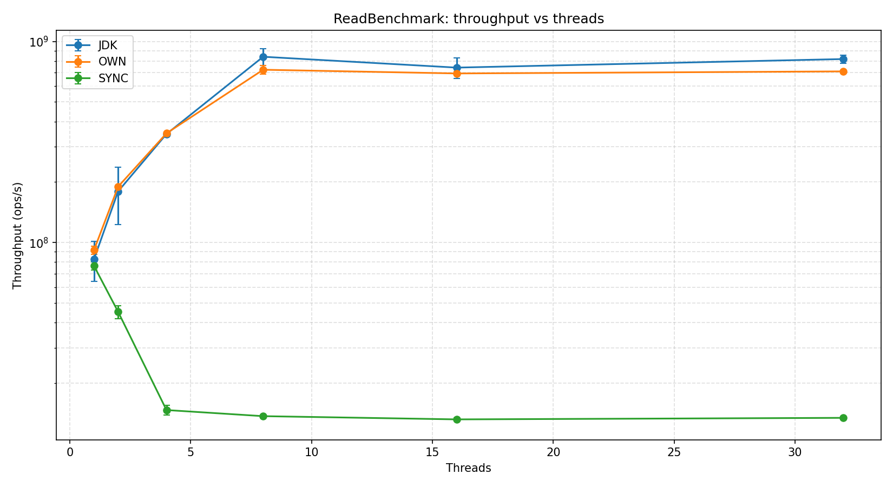
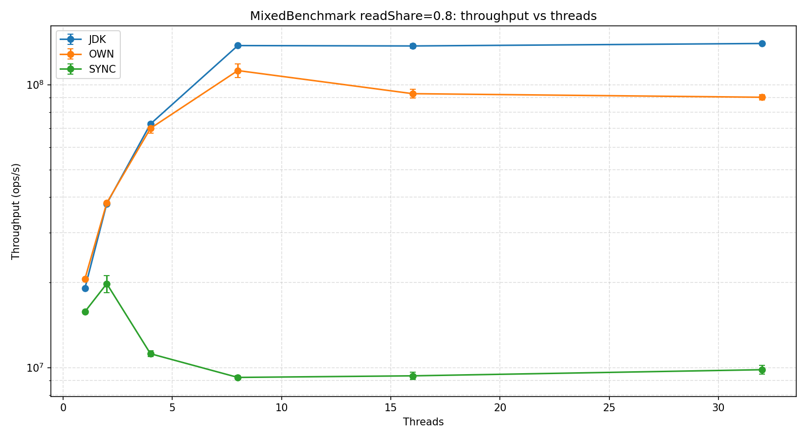
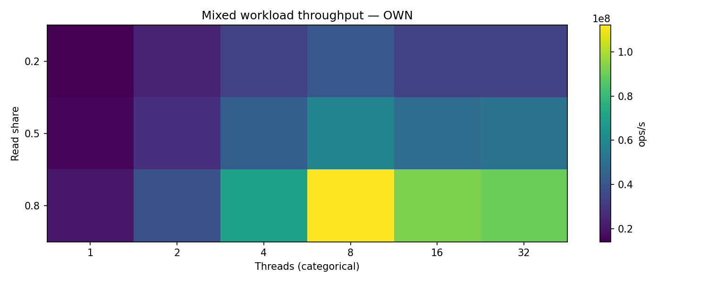
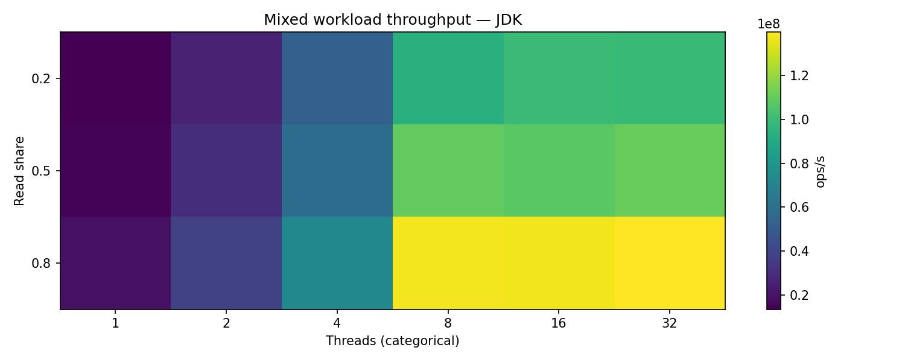
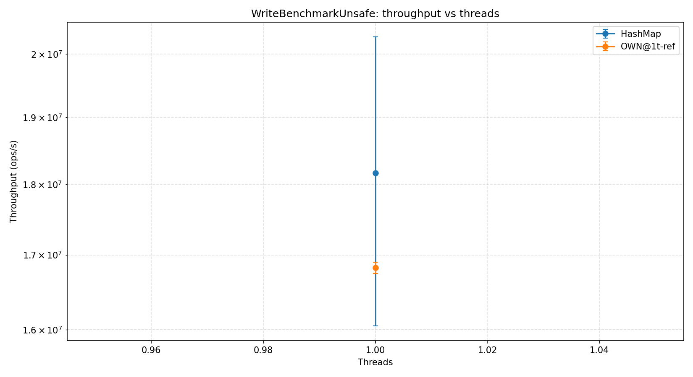
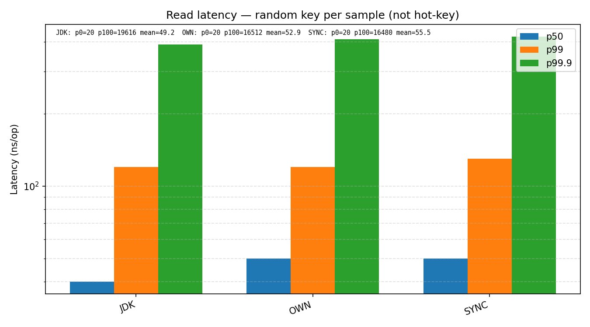
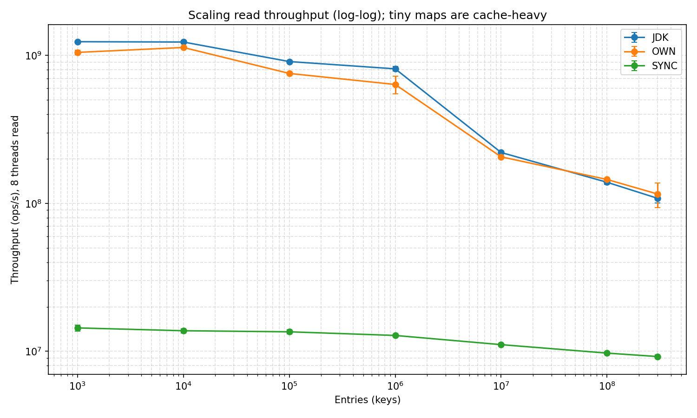
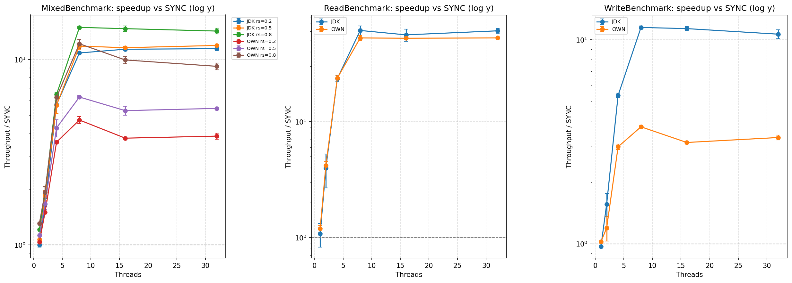

# Лаба 4 — детальный draft отчёта по бенчмаркам

> Этот файл — расширенная (черновая) версия [`BENCHMARK_REPORT.md`](BENCHMARK_REPORT.md). Содержит все таблицы, графики и комментарии, нужные для понимания и проверки результатов. Финальный отчёт — облегчённая выжимка.

Источник данных: [`results/full/jmh-results.json`](results/full/jmh-results.json) (**118** строк). Графики: `python3 scripts/plot_results.py` → [`results/full/graphs/`](results/full/graphs/).

**Профиль запуска (из `jvmArgs` и параметров каждой строки JSON):**

| Поле | Значение |
| --- | --- |
| Хост | Linux 7.0.6 (CachyOS), x86_64 |
| CPU | AMD **Ryzen 7 7800X3D** — 8 ядер / 16 потоков, 3D V-Cache |
| JDK / JMH | OpenJDK **26.0.1** / JMH **1.37** |
| Heap | `-Xmx24g -Xms256m -XX:+UseG1GC` |
| Forks | **2** (каждый ряд) |
| Read / Write / Mixed / `*Unsafe` thrpt | 5 × **10 с** прогрев + 5 × **10 с** измерение |
| `ScalingBenchmark.scalingRead_thr08` | 5 × **1 с** прогрев + 5 × **2 с** измерение |
| `ReadLatencyBenchmark.getSample` | sample-mode; 5 × **500 мс** прогрев + 5 × **1 с** измерение |

**Семантика throughput.** При `threads > 1` JMH выдаёт **агрегированный ops/s по всем рабочим потокам**, а не на поток. Реализации сравниваются при **одинаковом** thread count.

**Неопределённость.** `scoreError` — это **99.9 % CI half-width** на основной метрике. При **двух форках** в него попадает разброс между форками (JIT, page-cache); строки с большой относительной ошибкой отмечены отдельной таблицей в конце — для публикационных рейтингов нужен `fork ≥ 5`.

**Кросс-проверка.** `ReadBenchmark.read_thr08` (range = 1 048 576) и `ScalingBenchmark.scalingRead_thr08` @ 1e6 записей измеряют одну и ту же нагрузку из разных фикстур. Совпадают в пределах **±12 %** (OWN: 723 M против 636 M = −12 %; JDK: 839 M против 812 M = −3 %; SYNC: 13.7 M против 12.8 M = −7 %). Scaling-фикстура использует более короткие итерации (2 с против 10 с) и слегка занижает — это ожидаемо, а не баг.

---

## Методологические оговорки (читать в первую очередь)

### «UNSAFE» — это `java.util.HashMap`, а не `sun.misc.Unsafe`

Enum [`ImplKind.UNSAFE`](src/jmh/kotlin/benchmarks/MapSupport.kt) в бенчмарках мапится в [`PlainHashMap`](src/main/kotlin/hashmap/PlainHashMap.kt), тонкую обёртку над `java.util.HashMap`. На графиках ярлык **`HashMap`**. В JSON и в именах классов остаётся `Unsafe`/`UNSAFE` для обратной совместимости со старыми прогонами.

### Фикстуры `ReadBenchmarkUnsafe` и `WriteBenchmarkUnsafe` грузят сразу два мапа

Эти `@State`-инстансы держат **одновременно** `PlainHashMap` и `OWN ConcurrentHashMap`, оба наполненные до 1 048 576 записей. Это **удваивает working-set** по сравнению с `ReadBenchmark` (один мап на форк), поэтому `readOwnSingle_thr01` (**68.3 M**) на **−25.5 %** ниже, чем `read_thr01` OWN (**91.7 M**), при том что код OWN тот же самый. Бар-чарт [`unsafe_overhead_1thread.png`](results/full/graphs/unsafe_overhead_1thread.png) показывает `HashMap` (107.0 M) с пометкой относительно `read_thr01` OWN — сравнение «не яблоки к яблокам», см. подпись к графику.

### Boxing на горячем пути

Интерфейс [`IntLongMap`](src/jmh/kotlin/benchmarks/MapSupport.kt) принимает `Int` / `Long` → каждый вызов `putM` / `getM` **боксит ключ и значение** (или авто-боксит возврат). На 1 потоке **все четыре реализации укладываются в ≈ 15–16 M записей/с**: OWN 15.9, JDK 15.1, SYNC 15.5, даже HashMap 18.2. Аллокации `Long.valueOf` / `Integer.valueOf` доминируют над разницей реализаций.

### Mixed ≠ наивное гармоническое смешение Read + Write

`MixedBenchmark` на каждой операции добавляет ветвление `ThreadLocalRandom.nextDouble() < readShare`. Измеренная пропускная способность **всегда ниже**, чем наивное смешение изолированных read+write throughput-ов, из-за (а) лишний RNG + ветвление, (б) инвалидаций cache-line от переплетающихся записей, (в) конкуренции за те же горячие линии bucket-массива. См. таблицу [«Naive blend»](#naive-blend-mixed-vs-read--write) ниже — зазор растёт с долей чтений.

### Латентность измеряется на случайных ключах, не на «горячем» ключе

[`ReadLatencyBenchmark.getSample`](src/jmh/kotlin/benchmarks/ReadLatencyBenchmark.kt) тянет `ThreadLocalRandom.nextKey(range)` **на каждый sample** (range = 1 000 000). Медианная латентность — **~50 нс** у всех трёх реализаций, **не 20 нс**: случайные ключи промахиваются мимо L1 в большинстве случаев, так что в 50 нс уже входит типичный L2/L3-хоп плюс boxing.

### Scaling на 100 M / 300 M записей — это тест памяти, а не lookup-а

Каждая запись стоит ≈ 80 Б (`Node` 32 Б + boxed `Integer` 24 Б + boxed `Long` 24 Б при compressed oops). При 300 M записей это **≈ 24 ГБ живых объектов** + ~1.6 ГБ под bucket-массивы — упирается в `-Xmx24g`, эти точки идут под тяжёлым давлением G1 (видно по **19 % CI** для OWN @ 300 M). Считать их **memory-system + GC** тестом, а не чистым lookup-тестом.

---

## Чтения — `ReadBenchmark`, range = 1 048 576

Aggregate Mops/s (1 M = 1 000 000). `1→t` — множитель относительно 1-thread baseline той же реализации.

| threads | OWN | OWN 1→t | JDK | JDK 1→t | SYNC | SYNC 1→t |
| ---: | ---: | ---: | ---: | ---: | ---: | ---: |
| 1 | 91.7 ± 4.1 | 1.00× | 82.5 ± 18.6 | 1.00× | 76.6 ± 3.6 | 1.00× |
| 2 | 189.7 ± 1.2 | 2.07× | 179.7 ± 57.1 | 2.18× | 45.2 ± 3.4 | 0.59× |
| 4 | 349.2 ± 3.6 | 3.81× | 346.5 ± 2.0 | 4.20× | 14.7 ± 0.8 | 0.19× |
| 8 | 723.4 ± 36.1 | **7.89×** | 839.4 ± 78.8 | **10.17×** | 13.7 ± 0.1 | 0.18× |
| 16 | 693.3 ± 15.6 | 7.56× | 741.3 ± 87.4 | 8.98× | 13.2 ± 0.3 | 0.17× |
| 32 | 709.8 ± 2.4 | 7.74× | 817.6 ± 39.5 | 9.91× | 13.4 ± 0.2 | 0.18× |



**Интерпретация.**

- **OWN чтения скейлятся почти линейно до 8 потоков** (×7.89 на 8-ядерном CPU). За пределами 8 ядер мы попадаем в SMT-территорию; пропускная способность **проседает на ~4 %** на 16 t и восстанавливается на 32 t. Per-thread cost определяется `AtomicReferenceArray.getOpaque` (volatile-подобная загрузка) на bucket-head и volatile-чтением `Node.next` при обходе цепочки — на x86 это обычные load-ы с acquire-fence; SMT-сиблинги конкурируют за одни и те же cache-line.
- **JDK чтения выглядят «суперлинейно» на 8 потоках** (×10.17). Это артефакт измерения: `read_thr01` JDK имеет **23 % rel. CI**, а `read_thr02` JDK — **32 %** (бимодальный JIT-инлайнинг между форками). Широкий CI на 1 потоке поднимает соотношение; абсолютное значение на 8 t (839 M) информативно, само соотношение — лишь ориентир.
- **SYNC коллапсирует после 1 потока.** `Collections.synchronizedMap` — один грубый лок; многопоточные чтения сериализуются. 8 t / 1 t = 0.18 — чистый оверхед.

---

## Записи — `WriteBenchmark`, range = 1 048 576

| threads | OWN | OWN 1→t | JDK | JDK 1→t | SYNC | SYNC 1→t |
| ---: | ---: | ---: | ---: | ---: | ---: | ---: |
| 1 | 15.90 ± 0.16 | 1.00× | 15.08 ± 0.06 | 1.00× | 15.54 ± 0.08 | 1.00× |
| 2 | 23.22 ± 1.10 | 1.46× | 30.41 ± 0.16 | 2.02× | 19.43 ± 2.48 | 1.25× |
| 4 | 31.96 ± 0.96 | **2.01×** | 57.10 ± 1.26 | 3.79× | 10.69 ± 0.10 | 0.69× |
| 8 | 36.23 ± 0.23 | **2.28×** | 111.24 ± 0.42 | **7.37×** | 9.67 ± 0.16 | 0.62× |
| 16 | 29.81 ± 0.24 | 1.87× | 107.80 ± 1.92 | 7.15× | 9.50 ± 0.12 | 0.61× |
| 32 | 31.73 ± 0.74 | 2.00× | 101.87 ± 4.83 | 6.75× | 9.56 ± 0.14 | 0.61× |


**Интерпретация — главная история про скейлинг.**

OWN использует **`segmentCount = 16` `ReentrantLock`-ов** + separate chaining. Стандартный конструктор создаёт 16 сегментов; каждый `put` берёт лок сегмента. При 8 потоках и равномерном хеше **парадокс дней рождений** даёт вероятность ≈ **88 %** (1 − 16!/(16−8)!/16⁸), что хотя бы два потока хотят один и тот же сегмент; за пределами 8 потоков lock-contention доминирует, поэтому OWN записи выходят на плато **34–36 M ops/s** и **проседают на 18 %** на 16 потоках.

JDK `ConcurrentHashMap` (с JDK 8) использует **per-bin CAS / lock** без низкого сегментного потолка. При ≈ 2 M бакетов после заполнения 1 M записей, коллизия двух потоков на одном бакете маловероятна → почти линейный скейлинг до 8 потоков (**×7.37**), затем плато (упирается в memory bandwidth; ~1 % регрессии на 32 t из-за SMT).

SYNC с единственным глобальным локом коллапсирует сразу. Скачок **2 t > 1 t** (19.4 M против 15.5 M, +25 %) — хорошо известный **biased-lock / contention-warmup** транзиент: JIT компилирует чуть более горячий путь как только два потока начинают чередоваться. С 4 потоков глобальный лок пинает throughput к ≈ 9.5 M.

Flame-графы для самого интересного случая ([`results/flame/write_thr16_OWN.html`](results/flame/write_thr16_OWN.html) против [`results/flame/write_thr16_JDK.html`](results/flame/write_thr16_JDK.html)) подтверждают: горячие фреймы OWN — `ReentrantLock.lock` / `unlock` и `Segment.putLocked`; горячие фреймы JDK — `ConcurrentHashMap.putVal` с CAS-retry, никаких lock-park фреймов.

---

## Смешанная нагрузка — `MixedBenchmark`, range = 1 048 576

Полный thread-sweep по каждой доле чтений. Aggregate Mops/s.

### `rs = 0.2` (запись-доминирует)

| threads | OWN | JDK | SYNC |
| ---: | ---: | ---: | ---: |
| 1 | 14.0 | 13.6 | 13.5 |
| 2 | 23.3 | 25.7 | 15.5 |
| 4 | 32.9 | 52.4 | 9.2 |
| 8 | **40.8** | 93.7 | 8.6 |
| 16 | 33.0 | **99.5** | 8.8 |
| 32 | 33.6 | 99.3 | 8.7 |


### `rs = 0.5`

| threads | OWN | JDK | SYNC |
| ---: | ---: | ---: | ---: |
| 1 | 15.8 | 15.0 | 14.0 |
| 2 | 27.3 | 30.2 | 16.3 |
| 4 | 43.9 | 58.2 | 10.3 |
| 8 | **58.1** | 109.4 | 9.3 |
| 16 | 49.2 | 107.4 | 9.3 |
| 32 | 50.5 | **110.3** | 9.3 |


### `rs = 0.8` (чтение-доминирует)

| threads | OWN | JDK | SYNC |
| ---: | ---: | ---: | ---: |
| 1 | 20.6 | 19.1 | 15.8 |
| 2 | 38.2 | 37.9 | 19.8 |
| 4 | 70.1 | 72.6 | 11.2 |
| 8 | **112.2** | 137.4 | 9.2 |
| 16 | 92.9 | 137.0 | 9.3 |
| 32 | 90.2 | **139.8** | 9.8 |



**Сквозной паттерн по `rs`.**

- **OWN пик на 8 потоках, регрессия 15–19 % на 16 t, частичное восстановление на 32 t.** rs=0.2: 40.8 → 33.0 = **−19 %**; rs=0.5: 58.1 → 49.2 = **−15 %**; rs=0.8: 112.2 → 92.9 = **−17 %**. Записи продолжают сериализоваться на 16 сегментных локах, а потоков-читателей становится больше, так что каждый писатель становится точкой сериализации, к которой выстраиваются всё больше читателей (писатели также флашат cache-line, которые читатели перечитывают).
- **JDK выходит на плато на 8 потоках** и держится дальше (CAS-bins не упираются в 16 сегментов).
- **SYNC показывает тот же скачок 2 t > 1 t**, что и `WriteBenchmark` SYNC, на всех `rs` (lock-warmup, см. раздел про записи). Дальше 2 t SYNC коллапсирует к ~9 M.

### Heatmap-ы Mixed по реализациям

| OWN | JDK | SYNC |
| --- | --- | --- |
|  |  |  |

Внимание: каждый heatmap имеет **свою цветовую шкалу**, кросс-сравнение реализаций по цвету некорректно — нужно смотреть числа в таблицах выше или [`speedup_vs_sync_by_family.png`](results/full/graphs/speedup_vs_sync_by_family.png).

### Naive blend: Mixed против (Read + Write)

Наивное гармоническое смешение изолированных `read_thr08` и `write_thr08`:
\[ T_\text{naive}(rs) = 1 / \left( \dfrac{rs}{T_\text{read}} + \dfrac{1-rs}{T_\text{write}} \right) \]

| impl | rs | измеренный `mixed_thr08` | naive harmonic | измеренный / naive |
| --- | ---: | ---: | ---: | ---: |
| OWN | 0.2 | 40.8 M | 44.7 M | 91 % |
| OWN | 0.5 | 58.1 M | 69.0 M | 84 % |
| OWN | 0.8 | 112.2 M | 150.9 M | **74 %** |
| JDK | 0.2 | 93.7 M | 134.6 M | 70 % |
| JDK | 0.5 | 109.4 M | 196.5 M | 56 % |
| JDK | 0.8 | 137.4 M | 363.5 M | **38 %** |
| SYNC | 0.2 | 8.7 M | 10.3 M | 84 % |
| SYNC | 0.5 | 9.3 M | 11.3 M | 82 % |
| SYNC | 0.8 | 9.2 M | 12.6 M | 73 % |

Зазор **растёт с долей чтений**. Наивная гармоника переоценивает быстрый read-путь (например, JDK read 839 M против write 111 M — когда чтения занимают 80 % операций, гармоническое среднее тянется к быстрому числу), но в реальности каждая случайная запись **инвалидирует** cache-line, которые другие потоки читают, так что эффективная пропускная способность read-пути сильно ниже изолированной. JDK страдает сильнее OWN, потому что его изолированный read-показатель сильно выше — больше «запаса», который теряется.

---

## 1-thread baselines — `*Unsafe`-фикстура


| Benchmark | impl | ops/s | ± | Заметка |
| --- | --- | ---: | ---: | --- |
| `readUnsafe_thr01` | HashMap | 107.0 M | 3.1 M | большая фикстура, см. оговорку выше |
| `readOwnSingle_thr01` | OWN | 68.3 M | 2.2 M | **та же фикстура, что и HashMap**, 2 мапа загружены |
| `read_thr01` (ReadBenchmark) | OWN | 91.7 M | 4.1 M | фикстура с одним мапом |
| `writeUnsafe_thr01` | HashMap | 18.2 M | 2.1 M | |
| `writeOwnSingle_thr01` | OWN | 16.8 M | 0.1 M | |
| `write_thr01` (WriteBenchmark) | OWN | 15.9 M | 0.2 M | |

Зазор −25 % между `readOwnSingle_thr01` (68 M) и `read_thr01` OWN (92 M) — это **артефакт фикстуры**, отмеченный выше, а не разница в коде.

### Throughput по числу потоков, *Unsafe-фикстура (1 поток)

| Read | Write |
| --- | --- |
|  |  |

---

## Латентность чтений — `ReadLatencyBenchmark.getSample`, sample mode

Случайный ключ на каждый sample поверх 1 M записей. Столбец `mean` — это `score` от JMH (среднее всех samples); остальные столбцы — `scorePercentiles`.

| impl | mean (нс) | p50 | p90 | p95 | p99 | p99.9 | p99.99 | p99.999 | p100 |
| --- | ---: | ---: | ---: | ---: | ---: | ---: | ---: | ---: | ---: |
| OWN | 52.9 | 50 | 60 | 60 | 120 | 410 | 2 812 | 9 533 | 16 512 |
| JDK | 49.2 | 40 | 50 | 60 | 120 | 390 | 2 828 | 12 079 | 19 616 |
| SYNC | 55.5 | 50 | 60 | 110 | 130 | 420 | 2 708 | 9 670 | 16 480 |



- **p50 ≈ 40–50 нс**, **p99 ≈ 120–130 нс**: типичный L2/L3 + boxing на lookup.
- **SYNC p95 = 110 нс** против JDK/OWN 60 нс — synchronized-чтение продолжает платить CAS + memory barrier на каждый `get`, что видно по более широкому распределению за пределами медианы (и слегка более высокому среднему).
- **p99.99 ≈ 2.7–2.8 мкс по всем реализациям** — implementation-independent. Это **G1 young-GC scavenges, biased-lock revocations, safepoint-паузы**, которые JVM делает во время измерения, не стоимость lookup-а.
- **p100 = 16–20 мкс** так же independent от реализации — одна-две долгих JVM-паузы на форк.

Итог: медианная latency lookup-а примерно равна у всех трёх concurrent-реализаций на 1 потоке со случайными ключами; разница в хвосте — это JVM, не структура данных.

---

## Scaling по числу записей — `ScalingBenchmark.scalingRead_thr08`, 8 потоков

Aggregate Mops/s в зависимости от количества записей; per-thread = aggregate ÷ 8.

| записей | OWN | OWN per-thread | JDK | JDK per-thread | SYNC | SYNC per-thread |
| ---: | ---: | ---: | ---: | ---: | ---: | ---: |
| 1 000 | 1 048 ± 35 | 131.0 M | 1 238 ± 12 | 154.8 M | 14.4 ± 0.7 | 1.80 M |
| 10 000 | 1 132 ± 5 | **141.5 M** | 1 232 ± 30 | 153.9 M | 13.8 ± 0.5 | 1.72 M |
| 100 000 | 756 ± 7 | 94.5 M | 909 ± 20 | 113.6 M | 13.6 ± 0.5 | 1.69 M |
| 1 000 000 | 636 ± 87 | 79.5 M | 812 ± 29 | 101.5 M | 12.8 ± 0.2 | 1.60 M |
| 10 000 000 | 206 ± 2 | 25.8 M | 221 ± 3 | 27.6 M | 11.1 ± 0.2 | 1.39 M |
| 100 000 000 | 145 ± 2 | 18.1 M | 139 ± 5 | 17.4 M | 9.7 ± 0.2 | 1.22 M |
| 300 000 000 | 116 ± 22 | 14.5 M | 108 ± 7 | 13.5 M | 9.2 ± 0.3 | 1.15 M |



**Иерархия кэшей хорошо видна.** Per-entry ≈ 80 Б (Node 32 Б + boxed Integer 24 Б + boxed Long 24 Б, compressed oops). Кэши 7800X3D: **32 КБ L1d / 1 МБ L2 на ядро, 96 МБ shared L3** (3D V-Cache).

| Размер мапа | OWN aggregate | per-thread | Какой уровень кэша |
| ---: | ---: | ---: | --- |
| 1 k (~80 КБ) | 1 048 M | 131 M | L2-resident |
| 10 k (~800 КБ) | **1 132 M (пик)** | 141 M | L2 / L3 |
| 100 k (~8 МБ) | 756 M | 94 M | L3 |
| 1 M (~80 МБ) | 636 M | 80 M | L3 → DRAM; `read_thr01` OWN = 92 M/thread, цена 8-потокового шеринга ≈ 12 % |
| 10 M (~800 МБ) | 206 M | 26 M | DRAM — **первый большой knee** |
| 100 M (~8 ГБ) | 145 M | 18 M | DRAM-bound |
| 300 M (~24 ГБ) | 116 M | 15 M | DRAM + GC pressure |

**Рост 1 k → 10 k** (1 048 → 1 132 M, +8 %) — не противоречит «маленькое = быстро»: при 1 000 записей у OWN мало заполненных бакетов на сегмент, так что 8 читателей конкурируют за одни и те же горячие cache-line, в которых лежит `AtomicReferenceArray` (false sharing на bucket-head слотах); при 10 000 записей bucket-массив шире, чтения распределяются.

**SYNC** lock-bound на любом размере и почти не использует кэш: остаётся около **1.6 M/thread**, пока мап не станет настолько большим, что даже однопоточный lookup замедляется. Снижение с 14 M @ 1k до 9 M @ 300M — это просто рост стоимости каждого `get`, потому что table-walk доходит до DRAM.

---

## Speedup относительно `SYNC`



Три панели (Read / Write / Mixed). Mixed-панель содержит 6 линий: `OWN`/`JDK` × `rs = 0.2/0.5/0.8`. Log Y, штриховая линия на 1.0.

- **ReadBenchmark:** OWN ≈ **53 ×** SYNC на 8 потоках, JDK ≈ **61 ×**; оба держатся за пределами 8 t. SYNC = 1.0 по определению.
- **WriteBenchmark:** JDK ≈ **11.5 ×** SYNC на 8 потоках; OWN ≈ **3.7 ×** (ограничен 16-сегментными локами) — это самая чистая визуализация зазора OWN-vs-JDK по записям.
- **MixedBenchmark:** JDK при rs=0.8 достигает ≈ **15 ×** SYNC на 8 потоках; OWN ≈ **12 ×** в той же точке. При rs=0.2 зазор JDK/OWN сужается, потому что доминируют записи.

---

## Ячейки с высокой дисперсией (oговорка про 2 форка)

Строки с `scoreError / score > 10 %` в этом прогоне (отсортировано по относительной ошибке):

| relErr | benchmark | params | что делать |
| ---: | --- | --- | --- |
| 31.8 % | `read_thr02` | impl=JDK | пере-прогнать с ≥ 5 форков |
| 22.6 % | `read_thr01` | impl=JDK | пере-прогнать с ≥ 5 форков |
| 18.8 % | `scalingRead_thr08` | impl=OWN, entries=300 M | DRAM contention + GC; ужать на большем числе форков |
| 13.7 % | `scalingRead_thr08` | impl=OWN, entries=1 M | пере-прогнать с ≥ 5 форков |
| 12.8 % | `write_thr02` | impl=SYNC | пере-прогнать с ≥ 5 форков |
| 11.8 % | `read_thr16` | impl=JDK | SMT / bi-modal; ≥ 5 форков |
| 11.7 % | `writeUnsafe_thr01` | (HashMap) | пере-прогнать с ≥ 5 форков |

У всех остальных строк rel. error < 10 %. Скрипт `scripts/plot_results.py` сам печатает строки >25 % в stderr на каждом прогоне через `validate_jmh_rows`.

---

## Список графиков

| Файл | Что показывает |
| --- | --- |
| [`throughput_threads_ReadBenchmark.png`](results/full/graphs/throughput_threads_ReadBenchmark.png), [`..._WriteBenchmark.png`](results/full/graphs/throughput_threads_WriteBenchmark.png) | Lines + markers + error bars, 1→32 потока |
| [`throughput_threads_ReadBenchmarkUnsafe.png`](results/full/graphs/throughput_threads_ReadBenchmarkUnsafe.png), [`..._WriteBenchmarkUnsafe.png`](results/full/graphs/throughput_threads_WriteBenchmarkUnsafe.png) | HashMap + OWN-single-thread reference (1 поток) |
| [`throughput_threads_MixedBenchmark_rs{0.2, 0.5, 0.8}.png`](results/full/graphs/) | Mixed по read share |
| [`speedup_vs_sync_by_family.png`](results/full/graphs/speedup_vs_sync_by_family.png) | Read / Write / Mixed ÷ SYNC; log y; легенда вынесена |
| [`scaling_loglog.png`](results/full/graphs/scaling_loglog.png) | 1 k → 300 M записей, log–log, error bars |
| [`unsafe_overhead_1thread.png`](results/full/graphs/unsafe_overhead_1thread.png) | HashMap против OWN/JDK/SYNC на 1 потоке (read + write панели) |
| [`latency_percentiles.png`](results/full/graphs/latency_percentiles.png) | p50 / p99 / p99.9 с легендой; mean и p100 в подписи |
| [`mixed_heatmap_{OWN, JDK, SYNC}.png`](results/full/graphs/) | read-share × thread-count по каждой реализации |

Устаревшие имена (`throughput_threads_MixedBenchmark.png`, `throughput_threads_ScalingBenchmark.png`) удаляются plot-скриптом автоматически, если попадутся.

---

## Воспроизведение

```bash
./gradlew test --no-daemon -q                              # юнит-тесты
./gradlew jcstress --no-daemon                             # concurrency stress (quick mode в build.gradle.kts)
./gradlew jmh --no-daemon -Pjmh.heap=24g                   # полная матрица 118 строк; занимает часы
python3 scripts/plot_results.py                            # графики → results/full/graphs/
```

Лёгкий smoke (подмножество бенчмарков, 1 форк, итерации по 1 с):

```bash
./gradlew jmh --no-daemon -Pjmh.light=true -Pjmh.heap=1536m
```

Более короткий «report»-профиль (та же матрица, 1 форк, 1 с прогрев, 2 с измерение):

```bash
./gradlew jmh --no-daemon -Pjmh.report=true -Pjmh.heap=8g
```

Flame-графы для центрального результата по записям (через `JFR`-профайлер, без установки async-profiler):

```bash
./meta_run_flame.sh   # производит results/flame/write_thr16_{OWN,JDK}.html
```

Кастомный путь к JSON для plot-скрипта:

```bash
JMH_RESULTS_JSON=/path/to/jmh-results.json python3 scripts/plot_results.py
```

---

## jcstress concurrency-тесты

Quick mode (`jcstress { mode = "quick" }` в [`build.gradle.kts`](build.gradle.kts)). Все четыре теста проходят:

| Тест | Что проверяет |
| --- | --- |
| `PutGetStressTest` | `put`, за которым идёт concurrent `get`, возвращает 0 или 1, никогда не stale half-published значение |
| `ConcurrentPutStressTest` | два concurrent `put`-а оставляют финальное значение 10 или 20, без потерянных обновлений |
| `MergeAtomicityStressTest` | два concurrent `merge(+1)` оставляют финальное значение 2, никогда не 1 |
| `ResizeStressTest` | concurrent `put` + `get` сквозь resize видит либо старый, либо новый bucket-массив, никогда не наполовину достроенный (опирается на `@Volatile var buckets` в `Segment`) |

---

## Открытые follow-up-ы

- Пере-прогнать с **`fork ≥ 5`**, чтобы ужать CI у `read_thr01/02` JDK и точек scaling 1 M / 300 M; сейчас рейтинги в этих ячейках шумные.
- Снять flame-граф для `ReadBenchmark.read_thr16` OWN, чтобы расследовать ~4 % SMT-индуцированную регрессию относительно 8 потоков.
- Фикстура `*Unsafe` смешивает working-set-ы HashMap и OWN — разделить на два `@State`-класса, чтобы `readOwnSingle` и `read_thr01` OWN сошлись.
- Заменить boxed `IntLongMap` на primitive-specialised hot path (например, fastutil `Int2LongMap` для HashMap-baseline; специализированный OWN-мап), чтобы открыть реальную стоимость lookup/store на 1 потоке.
