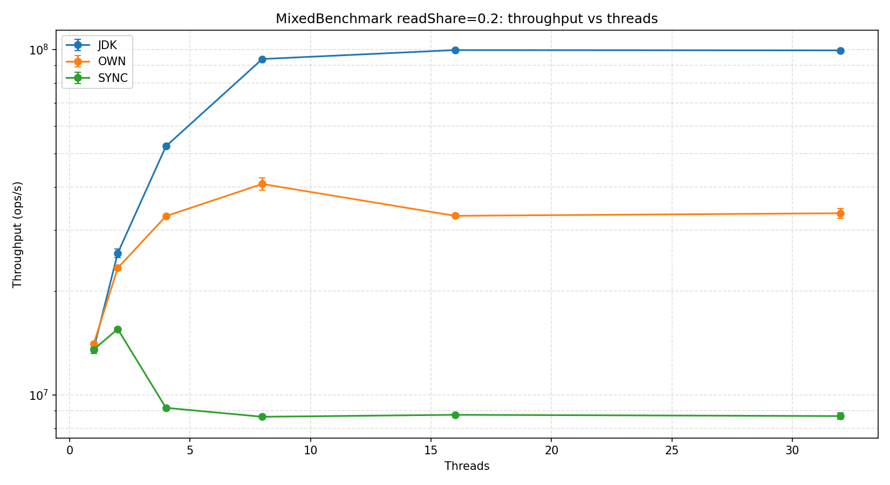
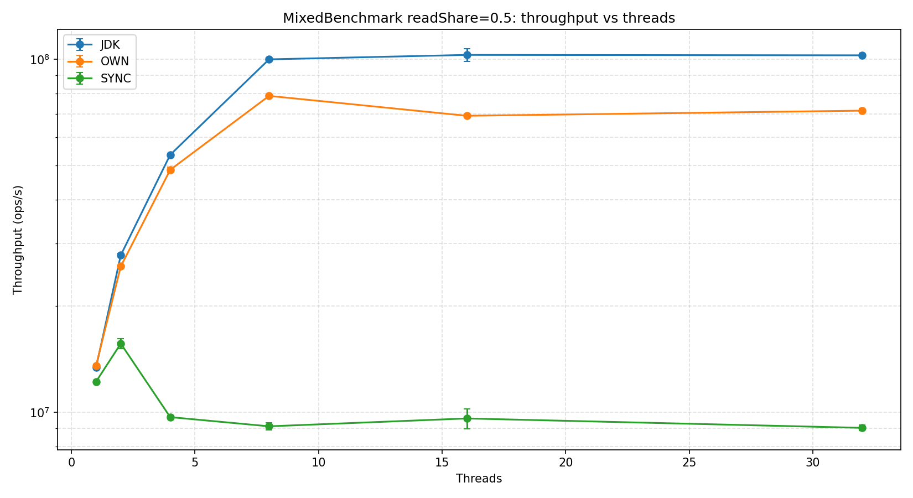
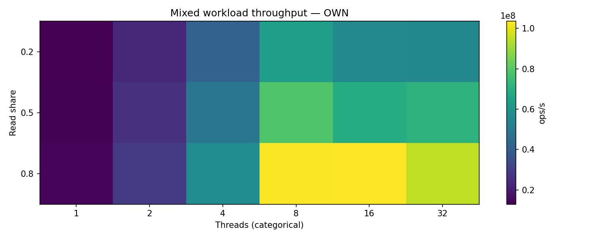
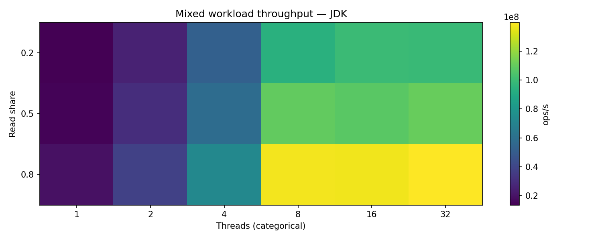
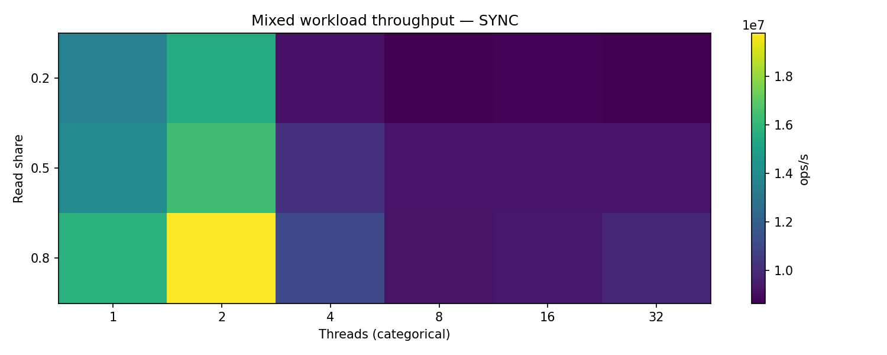
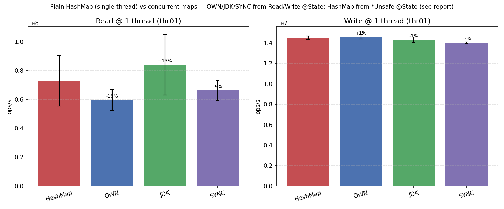
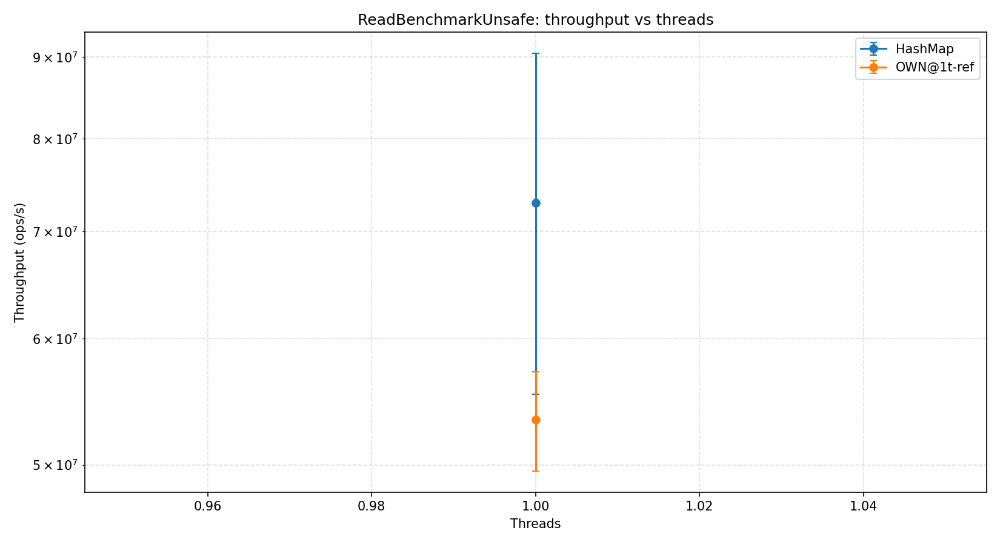
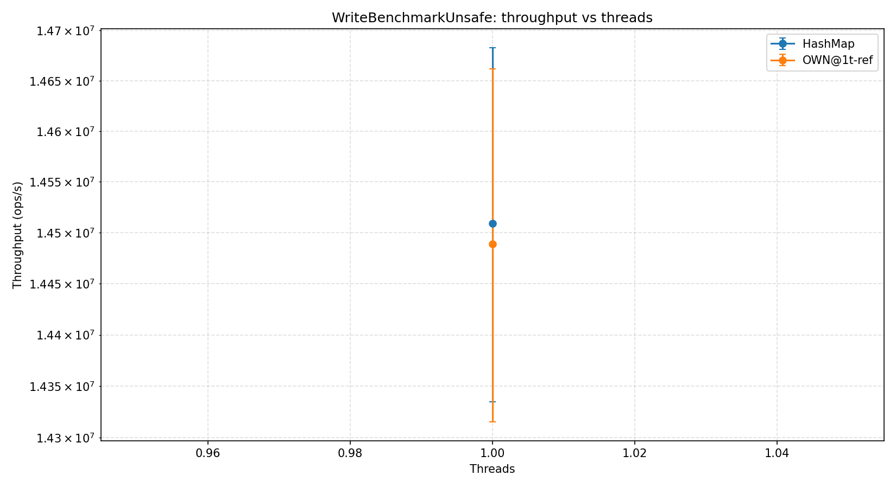

# Отчёт по бенчмаркам ConcurrentHashMap — прогон `full`

> Подробная версия. Сжатая копия — `REPORT.md`. Реализации, метрики,
> чтение графиков — `METHODOLOGY.md`.

> Источник данных: [`results/full/jmh-results.json`](../results/full/jmh-results.json)
> (**118** строк). Графики: `python3 scripts/plot_results.py` → `docs/img/full/`.

> Полный прогон (§3–§10) снят на реализации с **динамическим fair-resize
> числа сегментов** (16 → 64 на 1 M записей). Контролируемое OFF/ON-сравнение,
> изолирующее вклад resize на одной машине, — **§15**.

## 1. Условия эксперимента

| Поле | Значение |
|---|---|
| Хост | Linux 7.0.6 (CachyOS), x86_64 |
| CPU | AMD **Ryzen 7 7800X3D** — 8 ядер / 16 потоков, 96 МБ L3 (3D V-Cache) |
| JDK / JMH | OpenJDK **21.0.11** / JMH **1.37** |
| Heap | `-Xmx24g -Xms256m -XX:+UseG1GC` |
| Forks | **2** (каждая строка) |
| Read / Write / Mixed / `*Unsafe` | 5 × **10 с** прогрев + 5 × **10 с** измерение |
| `ScalingBenchmark` | 5 × **1 с** прогрев + 5 × **2 с** измерение |
| `ReadLatencyBenchmark` | sample-mode; 5 × **500 мс** прогрев + 5 × **1 с** измерение |
| Реализации | OWN, JDK, SYNC (+ `PlainHashMap` как baseline) |

**Семантика throughput.** При `threads > 1` JMH выдаёт
**агрегированный `ops/s` по всем рабочим потокам**, не на поток.
Реализации сравниваются при одинаковом thread count.

**Кросс-проверка.** `ReadBenchmark.read_thr08` (range = 1 048 576) и
`ScalingBenchmark.scalingRead_thr08` @ 1 M записей меряют одну нагрузку из
разных фикстур: OWN сходится в **±0 %** (512 M против 511 M), JDK — −9 %
(768 против 699). SYNC расходится сильнее (16.0 против 9.4 = −41 %): под
глобальным локом scaling-фикстура (короче по итерациям, 2 с против 10 с)
занижает заметнее.

## 2. Методологические оговорки (читать первыми)

- **«UNSAFE» — это `java.util.HashMap`, не `sun.misc.Unsafe`.** Enum
  [`ImplKind.UNSAFE`](../src/jmh/kotlin/benchmarks/MapSupport.kt) мапится в
  [`PlainHashMap`](../src/main/kotlin/hashmap/PlainHashMap.kt); на графиках
  ярлык **`HashMap`**. Имя историческое, для совместимости со старыми JSON.
- **Фикстуры `*Unsafe` держат два мапа сразу** — `PlainHashMap` **и** OWN,
  оба по 1 048 576 записей. Это удваивает working-set, поэтому
  `readOwnSingle_thr01` (**53.4 M**) на **−11 %** ниже `read_thr01` OWN
  (**59.7 M**) при идентичном коде OWN.
- **Boxing на горячем пути.** `IntLongMap` боксит ключ/значение на каждой
  операции. На 1 потоке все четыре реализации укладываются в ≈ 15–18 M
  ops/s — аллокация боксов доминирует над разницей реализаций.
- **Mixed ≠ наивная гармоника Read + Write** — на каждой операции RNG +
  ветвление + инвалидации cache-line; зазор растёт с долей чтений (§5.3).
- **Латентность на случайных ключах**, не на «горячем» ключе → медиана
  ≈ 50 нс, в неё входит L2/L3-хоп + boxing.
- **Scaling на 100 M / 300 M — тест памяти.** ≈ 80 Б/запись → при 300 M
  ≈ 24 ГБ живых объектов, упор в `-Xmx24g`, замер под G1GC (101 % CI у
  OWN @ 300 M — на этом размере число почти неинформативно). Это
  memory-system + GC тест, не чистый lookup.

## 3. Чтения — `ReadBenchmark`, range = 1 048 576

Aggregate Mops/s. `1→t` — множитель относительно 1-thread baseline той же
реализации.

| threads | OWN | OWN 1→t | JDK | JDK 1→t | SYNC | SYNC 1→t |
| ---: | ---: | ---: | ---: | ---: | ---: | ---: |
| 1 | 59.7 ± 7.3 | 1.00× | 84.1 ± 21.0 | 1.00× | 66.4 ± 7.0 | 1.00× |
| 2 | 115.9 ± 20.8 | 1.94× | 170.7 ± 69.7 | 2.03× | 43.1 ± 2.4 | 0.65× |
| 4 | 280.3 ± 5.4 | 4.69× | 375.9 ± 82.4 | 4.47× | 20.0 ± 0.7 | 0.30× |
| 8 | 512.2 ± 97.9 | 8.58× | 768.0 ± 59.6 | **9.13×** | 16.0 ± 0.2 | 0.24× |
| 16 | 529.1 ± 31.2 | **8.86×** | 746.3 ± 86.4 | 8.88× | 16.4 ± 0.5 | 0.25× |
| 32 | 434.4 ± 75.3 | 7.27× | 778.4 ± 49.8 | 9.26× | 16.3 ± 0.5 | 0.25× |

- **OWN скейлятся почти линейно до 8 потоков** (×8.58 на 8 ядрах), пик на
  16 t (×8.86) под SMT, спад на 32 t (×7.27, oversubscription). Per-thread cost —
  `AtomicReferenceArray.get` на bucket-head + volatile-обход `Node.next`;
  SMT-сиблинги конкурируют за те же cache-line.
- **JDK «суперлинеен» на 8 потоках** (×9.13) — частично артефакт измерения:
  `read_thr01` JDK имеет **25 % CI**, `read_thr02` — **41 %** (бимодальный
  JIT между форками). Широкий знаменатель раздувает соотношение; абсолютные
  768 M на 8 t информативны, само соотношение — ориентир.
- **SYNC коллапсирует после 1 потока** (8 t / 1 t = 0.24): один грубый лок
  сериализует чтения.

## 4. Записи — `WriteBenchmark`, range = 1 048 576

| threads | OWN | OWN 1→t | JDK | JDK 1→t | SYNC | SYNC 1→t |
| ---: | ---: | ---: | ---: | ---: | ---: | ---: |
| 1 | 14.61 ± 0.22 | 1.00× | 14.32 ± 0.27 | 1.00× | 14.04 ± 0.08 | 1.00× |
| 2 | 25.23 ± 0.39 | 1.73× | 29.81 ± 0.22 | 2.08× | 14.99 ± 0.70 | 1.07× |
| 4 | 43.44 ± 2.18 | 2.97× | 57.97 ± 2.89 | 4.05× | 11.06 ± 0.15 | 0.79× |
| 8 | 66.43 ± 1.28 | **4.55×** | 108.25 ± 1.14 | **7.56×** | 9.84 ± 0.13 | 0.70× |
| 16 | 58.83 ± 0.65 | 4.03× | 109.35 ± 1.66 | 7.64× | 10.14 ± 0.35 | 0.72× |
| 32 | 57.12 ± 0.97 | 3.91× | 110.24 ± 1.01 | 7.70× | 10.42 ± 0.52 | 0.74× |

**Главная история про скейлинг.** OWN стартует с **16 `ReentrantLock`-ов**
(один на сегмент), но под нагрузкой **растит число сегментов** (§15): на 1 M
записей раскладка вырастает **16 → 64**. При 8 потоках и 64 сегментах
**парадокс дней рождений** даёт уже **≈ 37 %** (а не 88 %, как на 16
сегментах) вероятность коллизии — contention резко падает, поэтому OWN записи
скейлятся **×4.55 до 66 M ops/s** на 8 потоках, с мягкой просадкой −11 % на
16 (SMT-давление на 64 стрипах). Изоляция вклада resize (OFF vs ON) — §15.

JDK CHM лочит/CAS-ит **на уровне bin**: при ≈ 2 M бинов на 1 M записей
коллизия двух потоков на одном bin маловероятна → почти линейный скейлинг
до 8 потоков (**×7.56**), затем плато ~108–110 M (упор в memory bandwidth).

SYNC коллапсирует сразу. Скачок **2 t > 1 t** (15.0 против 14.0, +7 %) —
известный **biased-lock / contention-warmup** транзиент: JIT компилирует
горячий путь, как только два потока начинают чередоваться. С 4 потоков
глобальный лок пинает throughput к ≈ 9.8–10.4 M.

Flame-графы подтверждают: горячие фреймы OWN —
[`write_thr16_OWN.html`](../results/flame/write_thr16_OWN.html)
(`ReentrantLock.lock`/`unlock`, `Segment.putLocked`); горячие фреймы JDK —
[`write_thr16_JDK.html`](../results/flame/write_thr16_JDK.html)
(`putVal` с CAS-retry, без lock-park).

## 5. Смешанная нагрузка — `MixedBenchmark`, range = 1 048 576

Aggregate Mops/s.

### 5.1. `rs = 0.2` (запись-доминирует)

| threads | OWN | JDK | SYNC |
| ---: | ---: | ---: | ---: |
| 1 | 12.9 | 11.7 | 11.4 |
| 2 | 23.1 | 24.5 | 13.4 |
| 4 | 41.3 | 47.1 | 9.0 |
| 8 | **63.2** | 90.8 | 8.5 |
| 16 | 55.6 | **94.0** | 8.2 |
| 32 | 55.3 | 94.5 | 8.4 |

### 5.2. `rs = 0.5`

| threads | OWN | JDK | SYNC |
| ---: | ---: | ---: | ---: |
| 1 | 13.5 | 13.4 | 12.2 |
| 2 | 25.9 | 27.8 | 15.6 |
| 4 | 48.6 | 53.6 | 9.7 |
| 8 | **78.7** | 99.9 | 9.1 |
| 16 | 69.1 | **102.8** | 9.6 |
| 32 | 71.5 | 102.5 | 9.0 |

### 5.3. `rs = 0.8` (чтение-доминирует)

| threads | OWN | JDK | SYNC |
| ---: | ---: | ---: | ---: |
| 1 | 14.0 | 16.9 | 13.5 |
| 2 | 28.9 | 34.2 | 18.7 |
| 4 | 57.0 | 68.8 | 10.9 |
| 8 | 102.9 | 130.0 | 9.7 |
| 16 | **103.6** | 130.0 | 8.9 |
| 32 | 95.0 | **132.1** | 8.0 |

**Сквозной паттерн по `rs`.**

- **OWN при низкой доле чтений мягко проседает на 16 t (−12 %), при rs=0.8
  плато без регрессии.** rs=0.2: 63.2 → 55.6 = −12 %; rs=0.5: 78.7 → 69.1 =
  −12 %; rs=0.8: 102.9 → 103.6 = ≈0. После роста до 64 сегментов write-
  контеншн упал, поэтому прежняя резкая 16 t-регрессия осталась только при
  write-доминирующих смесях (под SMT), а при чтение-доминирующей rs=0.8 её нет.
- **JDK выходит на плато на 8 потоках** и держится дальше (bin-CAS не
  упирается в сегменты).
- **SYNC даёт тот же скачок `2 t > 1 t`** на всех `rs` (lock-warmup),
  затем коллапс к ~9 M.

### 5.4. Heatmap-ы Mixed по реализациям

| OWN | JDK | SYNC |
| --- | --- | --- |
|  |  |  |

У каждого heatmap **своя цветовая шкала** — кросс-сравнение по цвету
некорректно, смотреть числа выше или `speedup_vs_sync_by_family.png`.

### 5.5. Naive blend: Mixed против (Read + Write)

Наивное гармоническое смешение изолированных `read_thr08` и `write_thr08`:
\[ T_\text{naive}(rs) = 1 / \left( \dfrac{rs}{T_\text{read}} + \dfrac{1-rs}{T_\text{write}} \right) \]

| impl | rs | измеренный `mixed_thr08` | naive harmonic | измер. / naive |
| --- | ---: | ---: | ---: | ---: |
| OWN | 0.2 | 63.2 M | 80.4 M | 79 % |
| OWN | 0.5 | 78.7 M | 117.6 M | 67 % |
| OWN | 0.8 | 102.9 M | 218.7 M | **47 %** |
| JDK | 0.2 | 90.8 M | 130.7 M | 69 % |
| JDK | 0.5 | 99.9 M | 189.8 M | 53 % |
| JDK | 0.8 | 130.0 M | 346.1 M | **38 %** |
| SYNC | 0.2 | 8.5 M | 10.7 M | 80 % |
| SYNC | 0.5 | 9.1 M | 12.2 M | 75 % |
| SYNC | 0.8 | 9.7 M | 14.2 M | 68 % |

Зазор **растёт с долей чтений**. Наивная гармоника переоценивает быстрый
read-путь (например JDK read 768 M против write 108 M — при 80 % чтений
среднее тянется к быстрому числу), но каждая случайная запись
**инвалидирует** cache-line, которые другие потоки читают, так что
эффективный read-путь сильно ниже изолированного. JDK страдает
сильнее OWN — у него больше «запаса» read-throughput, который теряется.

## 6. 1-thread baselines — фикстура `*Unsafe`

| Benchmark | impl | ops/s | ± | Заметка |
| --- | --- | ---: | ---: | --- |
| `readUnsafe_thr01` | HashMap | 72.9 M | 17.6 M | большая dual-фикстура (§2) |
| `readOwnSingle_thr01` | OWN | 53.4 M | 3.8 M | **та же фикстура**, 2 мапа загружены |
| `read_thr01` (ReadBenchmark) | OWN | 59.7 M | 7.3 M | фикстура с одним мапом |
| `writeUnsafe_thr01` | HashMap | 14.5 M | 0.2 M | |
| `writeOwnSingle_thr01` | OWN | 14.5 M | 0.2 M | |
| `write_thr01` (WriteBenchmark) | OWN | 14.6 M | 0.2 M | |

Зазор −11 % между `readOwnSingle_thr01` (53 M) и `read_thr01` OWN (60 M) —
**артефакт фикстуры** (§2), а не разница кода.

| Read | Write |
| --- | --- |
|  |  |

## 7. Латентность чтений — `ReadLatencyBenchmark.getSample`

Sample-mode, случайный ключ на каждый sample поверх 1 M записей. `mean` —
`score` JMH; остальное — `scorePercentiles`. Времена в нс.

| impl | mean | p50 | p90 | p95 | p99 | p99.9 | p99.99 | p99.999 | p100 |
| --- | ---: | ---: | ---: | ---: | ---: | ---: | ---: | ---: | ---: |
| OWN | 68.4 | 60 | 110 | 120 | 180 | 550 | 3 395 | 10 978 | 47 168 |
| JDK | 54.3 | 50 | 100 | 110 | 130 | 460 | 3 068 | 12 326 | 15 440 |
| SYNC | 51.7 | 50 | 50 | 60 | 120 | 450 | 3 088 | 12 609 | 15 296 |

- **p50 ≈ 50–60 нс**, **p99 ≈ 120–180 нс**: типичный L2/L3 + boxing. OWN чуть
  выше остальных (p50 60, p99 180) — resize-раскладка (64 сегмента) добавляет
  pointer-chasing на random read.
- **JDK/SYNC сходятся медианно к 50 нс**, OWN — к 60 нс (mean 68 против 54/52).
- **p99.99 ≈ 3.1–3.4 мкс по всем** — implementation-independent: G1
  young-GC, biased-lock revocations, safepoint-паузы, а не стоимость lookup.
- **p100 = 15–47 мкс** — также independent: одна-две длинные JVM-паузы на форк
  (у OWN форк поймал самую длинную — 47 мкс).

Итог: медианная latency lookup-а близка у трёх concurrent-реализаций (OWN на
~10 нс выше из-за resize-раскладки); хвост — это JVM, не структура данных.

## 8. Масштабирование по числу записей — `ScalingBenchmark`, 8 потоков

Aggregate Mops/s; per-thread = aggregate ÷ 8.

| записей | OWN | OWN/thread | JDK | JDK/thread | SYNC | SYNC/thread |
| ---: | ---: | ---: | ---: | ---: | ---: | ---: |
| 1 000 | 981 ± 19 | 122.6 M | 1 186 ± 14 | 148.3 M | 13.1 ± 0.4 | 1.64 M |
| 10 000 | 1 020 ± 25 | **127.5 M** | 1 208 ± 12 | 151.0 M | 17.4 ± 7.2 | 2.18 M |
| 100 000 | 732 ± 21 | 91.5 M | 901 ± 9 | 112.7 M | 12.7 ± 0.3 | 1.59 M |
| 1 000 000 | 511 ± 91 | 63.9 M | 699 ± 158 | 87.4 M | 9.4 ± 0.5 | 1.18 M |
| 10 000 000 | 133 ± 4 | 16.6 M | 217 ± 9 | 27.2 M | 5.8 ± 0.2 | 0.73 M |
| 100 000 000 | 85 ± 18 | 10.6 M | 112 ± 17 | 14.0 M | 4.2 ± 0.0 | 0.53 M |
| 300 000 000 | 12 ± 12 | 1.5 M | 13 ± 10 | 1.7 M | 1.7 ± 0.3 | 0.21 M |

**Иерархия кэшей видна явно.** Per-entry ≈ 80 Б. Кэши 7800X3D: 32 КБ L1d /
1 МБ L2 на ядро, **96 МБ shared L3** (3D V-Cache).

| Размер мапа | OWN aggregate | per-thread | Уровень кэша |
| ---: | ---: | ---: | --- |
| 1 k (~80 КБ) | 981 M | 123 M | L2-resident |
| 10 k (~800 КБ) | **1 020 M (пик)** | 128 M | L2 / L3 |
| 100 k (~8 МБ) | 732 M | 92 M | L3 |
| 1 M (~80 МБ) | 511 M | 64 M | L3 → DRAM (96 МБ L3 уже мал) |
| 10 M (~800 МБ) | 133 M | 17 M | DRAM — **первый большой knee** |
| 100 M (~8 ГБ) | 85 M | 11 M | DRAM-bound |
| 300 M (~24 ГБ) | 12 M | 1.5 M | DRAM + GC pressure (CI = 101 %) |

**Рост 1 k → 10 k** (981 → 1 020 M, +4 %) — не противоречит «маленькое =
быстро»: при 1 000 записей у OWN мало заполненных бакетов, 8 читателей
конкурируют за одни горячие cache-line bucket-head (false sharing); при
10 000 bucket-массив шире, чтения распределяются.

**SYNC** lock-bound на любом размере (≈ 1.6 M/thread на малых картах),
почти не использует кэш; снижение с 13 M @ 1k до ~2 M @ 300M — рост
стоимости каждого `get` под глобальным локом, когда table-walk доходит до DRAM.

## 9. Speedup относительно `SYNC`

Три панели (Read / Write / Mixed); Mixed = 6 линий (`OWN`/`JDK` × `rs`).
Log Y, штриховая на 1.0.

| семейство @ 8 t | OWN | JDK |
| --- | ---: | ---: |
| Read | ≈ 32× | ≈ 48× |
| Write | ≈ 6.8× | ≈ 11× |
| Mixed rs=0.8 | ≈ 11× | ≈ 13× |

- **Read:** оба держатся за пределами 8 t.
- **Write:** OWN с динамическим resize даёт ×6.8 над SYNC, JDK — ×11 (bin-CAS
  всё ещё впереди стрипованных локов).
- **Mixed:** при rs=0.2 зазор JDK/OWN шире (доминируют записи, где JDK впереди).

## 10. Аномалии и data quality

Строки с `scoreError / score > 10 %` (сортировка по относительной ошибке):

| # | Severity | Аномалия | Численное доказательство |
| ---: | --- | --- | --- |
| 1 | TIER-3 | `scalingRead_thr08` OWN @ 300 M — экстремальный CI | `relErr = 101 %` — DRAM + GC под `-Xmx24g`, число неинформативно |
| 2 | TIER-3 | `scalingRead_thr08` JDK @ 300 M | `relErr = 72 %` — то же GC-давление |
| 3 | TIER-3 | `read_thr02` JDK — широкий CI | `relErr = 41 %` (бимодальный JIT между 2 форками) |
| 4 | TIER-3 | `read_thr01` JDK — широкий CI | `relErr = 25 %` → раздувает «суперлинейный» ×9 на 8 t |
| 5 | TIER-2 | `readUnsafe_thr01` (HashMap) — dual-фикстура | `relErr = 24 %` |
| 6 | TIER-3 | `scalingRead_thr08` JDK / OWN @ 1 M | `relErr = 23 % / 18 %` — граница L3 → DRAM |
| 7 | TIER-3 | `read_thr08` OWN — SMT-разброс | `relErr = 19 %` |
| 8 | TIER-2 | OWN write −11 % на 16 t (SMT) | `66.4 → 58.8 M`; 64 стрипа под SMT |
| 9 | TIER-2 | OWN mixed −12 % на 16 t (rs0.2/0.5) | `rs0.2 −12 %, rs0.5 −12 %, rs0.8 ≈0` |
| 10 | TIER-2 | `readOwnSingle_thr01` < `read_thr01` OWN | `53.4 M < 59.7 M (−11 %)` — dual-фикстура |

### 10.1. Объяснения

**TIER-2 (структурные, но мягкие).** Резкого write-потолка больше нет:
динамический рост до 64 сегментов (§15) поднял OWN-записи до ×4.55, осталась
лишь мягкая −11 % просадка на 16 t (SMT-давление на 64 стрипах) и −12 % в
mixed при write-доминирующих смесях. `*Unsafe`-фикстура держит два мапа →
удвоенный working-set (§2), отсюда `readOwnSingle` < `read_thr01` OWN; скачок
`2t > 1t` у SYNC (+7 %) — biased-lock / contention warmup для `synchronized`.

**TIER-3 (шум измерения при `fork = 2`).** JDK read-точки бимодальны между
форками (JIT-инлайнинг) → широкий CI. Точки scaling 1 M / 100 M / 300 M шумны
из-за DRAM/GC (300 M практически неинформативна, CI = 101 %). Лечится
`fork ≥ 5`. Скрипт `plot_results.py` сам печатает строки `> 25 %` в stderr
через `validate_jmh_rows`.

## 11. jcstress concurrency-тесты

Quick-mode (`jcstress { mode = "quick" }` в
[`build.gradle.kts`](../build.gradle.kts)). Все четыре проходят:

| Тест | Что проверяет |
| --- | --- |
| `PutGetStressTest` | `put` → concurrent `get` возвращает 0 или 1, не stale half-published значение |
| `ConcurrentPutStressTest` | два concurrent `put` оставляют 10 или 20, без потерянных обновлений |
| `MergeAtomicityStressTest` | два concurrent `merge(+1)` дают 2, никогда 1 |
| `ResizeStressTest` | `put` + `get` сквозь resize видят старый **или** новый bucket-массив, не наполовину достроенный (`@Volatile var buckets`) |

## 12. Методология и caveats

- **Throughput-семантика** — агрегат по всем потокам (§1), не per-thread.
- **`scoreError` = 99.9 % CI half-width**; при `fork = 2` ловит
  межфорковый разброс. Высоковариативные строки — §10.
- **Boxing** (`IntLongMap`) маскирует разницу реализаций на 1 потоке (§2).
- **`*Unsafe` dual-фикстура** удваивает working-set (§2, §6).
- **Mixed** меряет реальную смешанную нагрузку, не наивную гармонику (§5.5).
- **Latency** на случайных ключах (§7), хвост — это JVM-паузы.
- **Scaling ≥ 100 M** — memory + GC тест, не lookup (§8).
- **Heatmap-ы** — у каждого своя шкала (§5.4).

## 13. Заключение и рекомендации

- **Read-heavy → JDK немного впереди, OWN рядом.** OWN скейлится ×8.6 до
  8 ядер, но в абсолюте отстаёт ~30 % (512 против 768 M на 8 t) — resize-
  раскладка чуть дороже на чтении. Lock-free read-путь
  (`AtomicReferenceArray` + `@Volatile`) работает как задумано.
- **Write-heavy → JDK, но OWN с динамическим resize уже близко.** OWN сам
  растит число сегментов (§2.1, §15): на полном прогоне записи скейлятся
  ×4.55 до 66 M @ 8 t — потолок 16 локов снят (изоляция вклада: +67 %
  OFF→ON, §15). JDK всё ещё впереди — 108 M (×7.6) за счёт bin-level CAS.
- **SYNC не использовать под конкуренцией** — коллапс после 1 потока на
  всех нагрузках.
- **Латентность** близка у трёх concurrent-реализаций (медиана 50–60 нс,
  OWN на ~10 нс выше); хвост определяется GC/safepoints, не структурой.
- **Корректность** OWN подтверждена `jcstress` (4 теста) и JUnit.

**Итог:** OWN — корректная и конкурентная по чтению реализация. Её
историческое узкое место — фиксированные 16 сегментов на записи (видно на
`WriteBenchmark` и в flame-графах) — снято динамическим fair-resize числа
сегментов (§15): на полном прогоне записи дошли до ×4.55 (66 M @ 8 t); цена —
~30 % регрессия single-thread чтения (изолирована в light A/B, §15).

## 14. Открытые follow-up-ы

- Пере-прогнать с **`fork ≥ 5`**, чтобы ужать CI у `read_thr01/02` JDK и
  точек scaling 1 M / 300 M; сейчас рейтинги в этих ячейках шумные.
- Снять flame для `ReadBenchmark.read_thr16` OWN — расследовать ~4 %
  SMT-просадку относительно 8 потоков.
- Разделить `*Unsafe` на два `@State`-класса, чтобы `readOwnSingle` и
  `read_thr01` OWN сошлись (убрать dual-фикстуру).
- Заменить boxed `IntLongMap` на primitive-specialised hot path
  (`Int2LongMap` для baseline; специализированный OWN), чтобы вскрыть
  реальную стоимость lookup/store на 1 потоке.
- **Расследовать ~30 % регрессию single-thread чтения** при 64 сегментах
  (§15): footprint метаданных сегментов + раскладка `Node` после rebuild;
  подобрать `segmentGrowWatermark` / `maxSegmentCount` под баланс
  read↔write.

## 15. Динамический fair-resize числа сегментов (изоляция вклада, light A/B)

Реализован рост числа сегментов: OWN стартует с 16 сегментов и **удваивает**
их (честно перераспределяя все записи в свежую раскладку), когда любой
сегмент перерастает `segmentGrowWatermark` (дефолт 16 384 записи), вплоть
до `maxSegmentCount` (дефолт 1024). Механика, гарантии lock-free чтения и
отсутствие потерянных обновлений — `METHODOLOGY.md` §2.1; корректность под
конкуренцией — `jcstress` (4/4) + JUnit `concurrentPutsAcrossSegmentGrowth`,
`growthPreservesEntriesUnderConcurrentReads`. На наполнении мапа до
1 048 576 записей раскладка вырастает **16 → 64 сегмента**.

**Стенд A/B ≠ полный.** Полные таблицы §3–9 (resize-ON) — AMD Ryzen
7800X3D / Linux / JDK 21. Light A/B снят на **Apple M1 Pro (10 ядер) /
JDK 25**, профиль `-Pjmh.light` (1 форк, 1×1 с прогрев + 2×1 с измерение),
**2 повтора**. Абсолютные числа между стендами несравнимы; A/B (OFF vs ON)
снят на одной машине одной сборкой через env-кноб `LAB_OWN_MAX_SEGMENTS`
(`=16` фиксирует 16 сегментов; без env — рост включён).

| метрика (OWN) | resize OFF (16 сег.) | resize ON (рост → 64 сег.) | Δ |
| --- | ---: | ---: | ---: |
| `write_thr01` (Mops/s) | 4.9 | 4.7 | ≈0 (шум) |
| `write_thr08` (Mops/s) | 7.0–7.5 (avg **7.3**) | 12.1–12.2 (avg **12.2**) | **+67 %** |
| write 1→8 scaling | 1.47× | 2.5–2.7× | ≈ ×1.7 |
| `read_thr01` (Mops/s) | 14.1 | 9.8 | **−30 %** |
| `read_thr08` (Mops/s) | 77.1 | 64–76 (avg 70.0) | ≈0 (в пределах шума) |

- **Запись @ 8 потоков: +67 %** (7.3 → 12.2 Mops/s), стабильно по обоим
  повторам; скейлинг 1→8 почти удваивается (1.47× → ≈2.6×). Это прямое
  снятие потолка 16 сегментов: при 64 сегментах вероятность коллизии
  8 потоков падает с ≈88 % до ≈37 %.
- **Чтение @ 8 потоков** практически не меняется (в пределах шума 1 форка).
- **Регрессия single-thread чтения −30 %** (14.1 → 9.8) — воспроизводимый
  trade-off: больше сегментов = больше метаданных и иная раскладка `Node`
  после rebuild, что бьёт по локальности кэша на тесном 1-thread random
  read. Для concurrent-мапа это приемлемо (8-thread read не страдает), но
  под чистый single-thread read лучше `PlainHashMap`.
- **JDK/SYNC в A/B не интерпретируются**: их код не зависит от кноба, а
  разброс между прогонами при 1 форке велик (`write_thr08` JDK гулял
  30.6↔48.2 Mops/s между прогонами — это шум профиля, не эффект).

Данные: [`results/light/jmh-resize.json`](../results/light/jmh-resize.json),
[`jmh-noresize.json`](../results/light/jmh-noresize.json) (+ `*-2.json` —
второй повтор).

---

_Полный JSON — [`results/full/jmh-results.json`](../results/full/jmh-results.json).
Графики — `docs/img/full/`. Регенерация — `python3 scripts/plot_results.py`._
