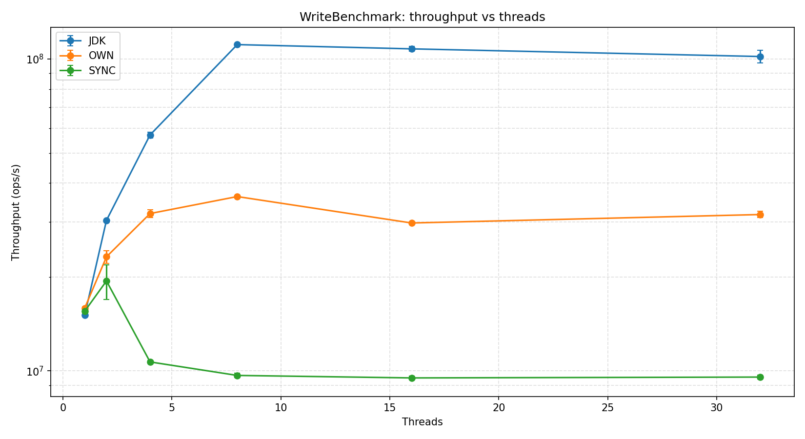
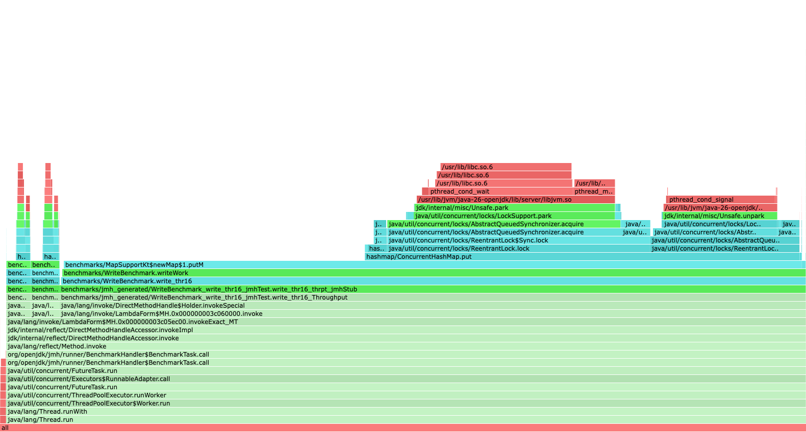
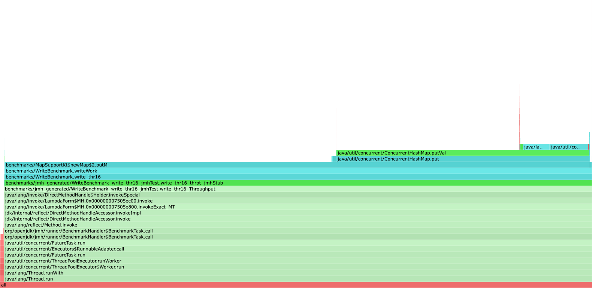
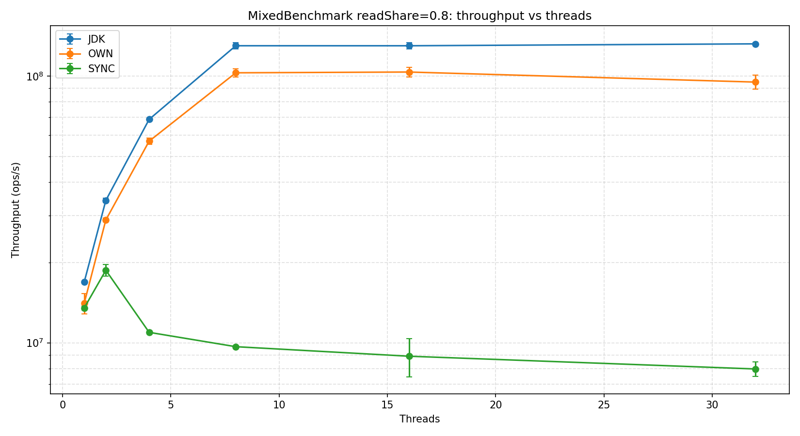
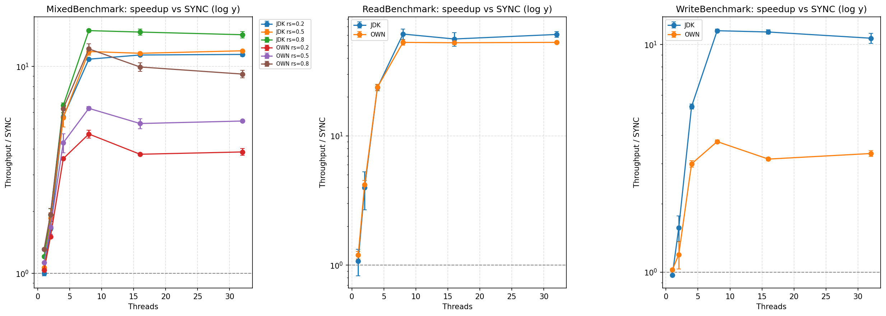
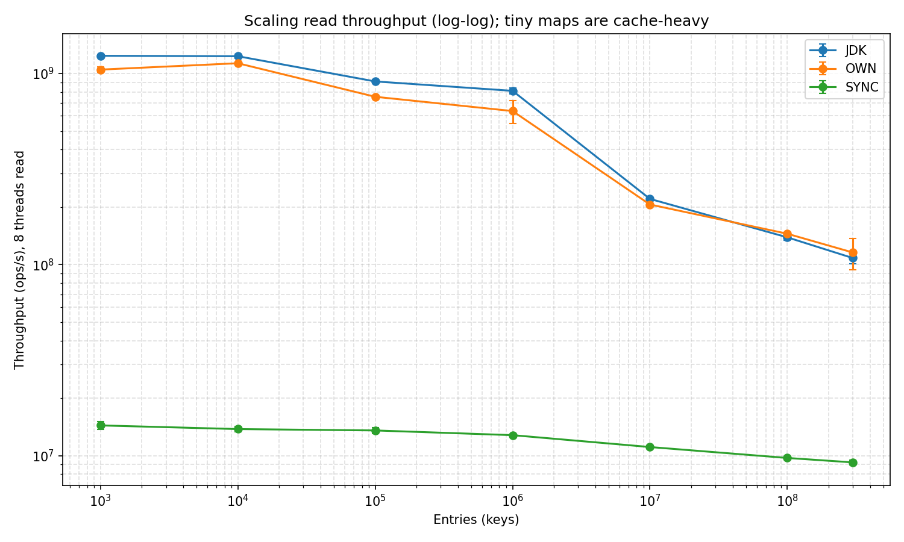

# Краткий отчёт по бенчмаркам ConcurrentHashMap — прогон `full`

> Краткая версия. Все таблицы, графики и подробный разбор — `DRAFT.md`.
> Реализации, метрики и чтение графиков — `METHODOLOGY.md`.

> Числа из [`results/full/jmh-results.json`](../results/full/jmh-results.json)
> (118 строк). Графики — `docs/img/full/`.

> ⚠️ Таблицы §3–§9 сняты на реализации с **фиксированными 16 сегментами**
> (до динамического resize). Сам resize реализован и провалидирован на
> light-прогоне — **§5a**; полный ре-ран на новой реализации ожидается.

## 1. Условия эксперимента

- **Реализация:** [`hashmap.ConcurrentHashMap`](../src/main/kotlin/hashmap/ConcurrentHashMap.kt) —
  striped-сегменты (старт 16) с `ReentrantLock`, separate chaining,
  lock-free чтения (`AtomicReferenceArray` + `@Volatile`); число сегментов
  **растёт динамически** под нагрузкой (§5a).
- **Сравнение с:** JDK `ConcurrentHashMap`, `Collections.synchronizedMap`
  (SYNC), `java.util.HashMap` (baseline `PlainHashMap`, в JSON — `UNSAFE`).
- **Хост:** AMD Ryzen 7 7800X3D (8 ядер / 16 потоков, 96 МБ L3), Linux,
  OpenJDK 26.0.1, JMH 1.37, `-Xmx24g`, G1GC.
- **Профиль:** forks = 2; main 5×10 с прогрев + 5×10 с измерение;
  Scaling 5×1 с + 5×2 с; Latency sample-mode 5×500 мс + 5×1 с.

## 2. Главные выводы

- **Чтения OWN скейлятся почти линейно до 8 потоков** (×7.9), затем плато
  под SMT; идут вровень с JDK (723 против 839 M ops/s на 8 потоках).
- **Записи OWN не скейлятся за 8 потоков** (плато ≈ 36 M ops/s, ×2.3): 16
  сегментных локов — узкое место. JDK CAS-ит на уровне bin → ×7.4 (111 M).
- **SYNC коллапсирует** уже после 1 потока (один глобальный лок).
- **Латентность** медианно ≈ 50 нс у всех трёх concurrent-реализаций;
  разница в хвосте — GC/safepoint-паузы, не структура данных.

## 3. Чтения — `ReadBenchmark`

Aggregate Mops/s, range = 1 048 576.

| threads | OWN | JDK | SYNC |
| ---: | ---: | ---: | ---: |
| 1 | 91.7 | 82.5 | 76.6 |
| 2 | 189.7 | 179.7 | 45.2 |
| 4 | 349.2 | 346.5 | 14.7 |
| 8 | **723.4** | **839.4** | 13.7 |
| 16 | 693.3 | 741.3 | 13.2 |
| 32 | 709.8 | 817.6 | 13.4 |


OWN и JDK почти линейны до 8 ядер, затем плато под SMT. SYNC обваливается
из-за глобального лока.

## 4. Записи — `WriteBenchmark`

| threads | OWN | JDK | SYNC |
| ---: | ---: | ---: | ---: |
| 1 | 15.9 | 15.1 | 15.5 |
| 2 | 23.2 | 30.4 | 19.4 |
| 4 | 32.0 | 57.1 | 10.7 |
| 8 | **36.2** | **111.2** | 9.7 |
| 16 | 29.8 | 107.8 | 9.5 |
| 32 | 31.7 | 101.9 | 9.6 |



OWN (в этом pre-resize прогоне) масштабируется только в ×2.3 до 8 потоков
и проседает на 18 % на 16: 16 сегментных `ReentrantLock`-ов, вероятность
коллизии по парадоксу дней рождений ≈ 88 % при 8 потоках. JDK CAS-ит на
уровне бакетов (≈ 2 M бинов на 1 M записей), коллизии редки → ×7.4.
Flame-графы подтверждают:
[`write_thr16_OWN`](../results/flame/write_thr16_OWN.html) горит на
`ReentrantLock`, [`write_thr16_JDK`](../results/flame/write_thr16_JDK.html)
— на CAS-retry. **Этот потолок снят динамическим resize — см. §5a.**

| OWN — `ReentrantLock` contention | JDK — CAS retry |
|:---:|:---:|
|  |  |

## 5a. Динамический fair-resize сегментов (light-валидация)

OWN теперь **удваивает число сегментов** (честно перераспределяя записи в
свежую раскладку), когда сегмент перерастает watermark (дефолт 16 384
записи), до `maxSegmentCount` (дефолт 1024). На 1 M записей раскладка
растёт **16 → 64 сегмента**. Lock-free чтения и отсутствие потерянных
обновлений под ростом — `jcstress` (4/4) + JUnit; механика —
`METHODOLOGY.md` §2.1, разбор — `DRAFT.md` §15.

A/B снят на **Apple M1 Pro / JDK 25**, light-профиль (1 форк, 2 повтора) —
**другой стенд, чем §3–9**; абсолютные числа со полным прогоном
несопоставимы, сравнивается только OFF vs ON на одной машине.

| метрика (OWN) | OFF (16 сег.) | ON (рост → 64) | Δ |
| --- | ---: | ---: | ---: |
| `write_thr08` | 7.3 | **12.2** | **+67 %** |
| write 1→8 scaling | 1.47× | ≈2.6× | ≈ ×1.7 |
| `read_thr01` | 14.1 | 9.8 | −30 % |
| `read_thr08` | 77.1 | 70.0 | ≈0 (шум) |


Запись @ 8 потоков растёт на **+67 %** (снят потолок 16 локов); цена —
~30 % регрессия single-thread чтения (больше метаданных/иная раскладка
`Node`), 8-thread чтение не страдает.

## 5. Смешанная нагрузка — `MixedBenchmark` @ `rs = 0.8`

| threads | OWN | JDK | SYNC |
| ---: | ---: | ---: | ---: |
| 1 | 20.6 | 19.1 | 15.8 |
| 2 | 38.2 | 37.9 | 19.8 |
| 4 | 70.1 | 72.6 | 11.2 |
| 8 | **112.2** | **137.4** | 9.2 |
| 16 | 92.9 | 137.0 | 9.3 |
| 32 | 90.2 | 139.8 | 9.8 |



OWN пик на 8 потоках, регрессия −17 % на 16 t из-за того же write-лока;
JDK выходит на плато. Полные таблицы `rs = 0.2 / 0.5` — в `DRAFT.md` §5.

## 6. Speedup относительно SYNC



| семейство @ 8 t | OWN | JDK |
| --- | ---: | ---: |
| Read | ≈ 53× | ≈ 61× |
| Write | ≈ 3.7× | ≈ 11.5× |
| Mixed rs=0.8 | ≈ 12× | ≈ 15× |

## 7. Масштабирование по числу записей — `ScalingBenchmark` @ 8 потоков

| записей | OWN | JDK | SYNC |
| ---: | ---: | ---: | ---: |
| 1 000 | 1 048 | 1 238 | 14.4 |
| 10 000 | **1 132** | 1 232 | 13.8 |
| 100 000 | 756 | 909 | 13.6 |
| 1 000 000 | 636 | 812 | 12.8 |
| 10 000 000 | 206 | 221 | 11.1 |
| 100 000 000 | 145 | 139 | 9.7 |
| 300 000 000 | 116 | 108 | 9.2 |



Виден переход кэш → DRAM на 1 M → 10 M записей (working-set уходит за
96 МБ L3). При 300 M мап весит ≈ 24 ГБ и упирается в `-Xmx24g` — замеры
идут под GC.

## 8. Латентность чтений — `ReadLatencyBenchmark.getSample`

Sample-mode, случайный ключ на каждый замер. Времена в нс.

| impl | mean | p50 | p99 | p99.9 | p99.99 |
| --- | ---: | ---: | ---: | ---: | ---: |
| OWN | 52.9 | 50 | 120 | 410 | 2 812 |
| JDK | 49.2 | 40 | 120 | 390 | 2 828 |
| SYNC | 55.5 | 50 | 130 | 420 | 2 708 |


Все три сходятся к ≈ 50 нс на медиане. Хвост p99.99 ≈ 2.7–2.8 мкс
одинаков — это G1-паузы / safepoints, общие для JVM.

## 9. Аномалии и data quality

| Severity | Аномалия | Доказательство |
| --- | --- | --- |
| TIER-1 | OWN write плато + −18 % на 16 t (**адресовано**, §5a) | `36.2 → 29.8 M`; 16 сегментных локов |
| TIER-1 | OWN mixed регрессия 15–19 % на 16 t | `rs0.2 −19 %, rs0.5 −15 %, rs0.8 −17 %` |
| TIER-2 | `readOwnSingle_thr01` < `read_thr01` OWN | `68.3 < 91.7 M` — dual-фикстура `*Unsafe` |
| TIER-3 | `read_thr01/02` JDK широкий CI | `relErr 22.6 % / 31.8 %` — JIT-бимодальность, `fork ≥ 5` |
| TIER-3 | scaling OWN @ 1 M / 300 M | `relErr 13.7 % / 18.8 %` — DRAM + GC |

Полный разбор с tiers — `DRAFT.md` §10.

## 10. jcstress

Quick-mode, все четыре теста проходят:

| Тест | Что проверяет |
| --- | --- |
| `PutGetStressTest` | `put` → concurrent `get` = 0 или 1, не stale |
| `ConcurrentPutStressTest` | два `put` → 10 или 20, без потерь |
| `MergeAtomicityStressTest` | два `merge(+1)` → 2, никогда 1 |
| `ResizeStressTest` | `put`+`get` сквозь resize видят целый bucket-массив |

## 11. Заключение

- **Read-heavy:** OWN ≈ JDK (lock-free чтения работают).
- **Write-heavy:** OWN раньше упирался в 16 сегментов; теперь **число
  сегментов растёт динамически** — light-валидация даёт +67 % к write
  @ 8 t (§5a). Для канонических чисел нужен полный ре-ран; пока для
  максимума под запись остаётся JDK.
- **SYNC** — не использовать под конкуренцией.
- **Корректность** OWN (включая concurrent resize) подтверждена `jcstress`
  + JUnit.

## Воспроизведение

```bash
./gradlew test --no-daemon -q                   # JUnit
./gradlew jcstress --no-daemon                  # concurrency stress (quick)
./gradlew jmh --no-daemon -Pjmh.heap=24g        # полная матрица 118 строк
python3 scripts/plot_results.py                 # графики → results/full/graphs/
```
